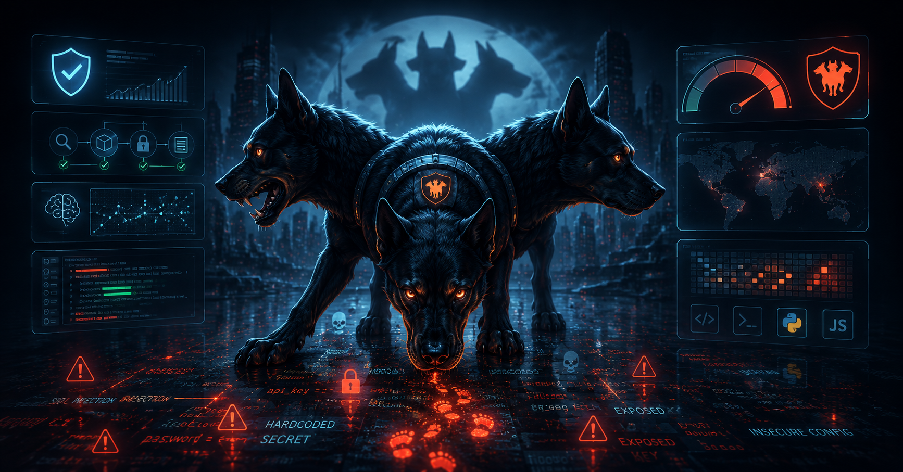

<p align="center">
  
</p>

<h1 align="center">🛡️ Cerberus</h1>

<p align="center">
Auditor Inteligente de Segurança para Projetos Desenvolvidos com IA
</p>

<p align="center">


</p>


# 🛡️ Cerberus — Auditor de Segurança para Repositórios

O Cerberus é uma ferramenta de auditoria de segurança para repositórios de código. Ela executa varreduras estáticas, detecta segredos expostos, analisa dependências vulneráveis, calcula um score de risco e gera um relatório em Markdown — com análise complementar via IA local (Ollama).

---

## Estrutura do projeto

```text
Cerberus/
├── auditor/
│   ├── __init__.py
│   ├── main.py                     ← Ponto de entrada e orquestrador do pipeline
│   ├── analyzers/
│   │   └── score_de_risco.py       ← Cálculo de score e nível de risco
│   ├── llm/
│   │   └── llm_analyzer.py         ← Análise complementar via Ollama
│   ├── models/
│   │   └── findings.py             ← Modelo Finding + normalizadores
│   ├── reports/
│   │   └── markdown_report.py      ← Geração do relatório em Markdown
│   └── scanners/
│       ├── dependency_scanner.py   ← pip-audit / npm audit
│       ├── gitleaks_scanner.py     ← Detecção de segredos
│       └── semgrep_scanner.py      ← Análise estática de código
├── reports_resultado/              ← Relatórios gerados (criado automaticamente)
├── requirements.txt
└── README.md
```

---

## Arquitetura e pipeline

O Cerberus opera como uma pipeline linear em 5 etapas:

```
Entrada (--target)
    ↓
Coleta — Semgrep · Gitleaks · pip-audit / npm audit
    ↓
Normalização — todos os achados → formato Finding
    ↓
Análise — score de risco + análise por IA local
    ↓
Saída — relatório Markdown em reports_resultado/
```

Cada etapa é independente. Se uma ferramenta externa não estiver disponível, a etapa correspondente é ignorada e a auditoria continua com os demais scanners.

---

## Responsabilidades de cada módulo

| Módulo | Responsabilidade |
| :--- | :--- |
| `main.py` | Orquestra o pipeline, valida o ambiente e expõe a CLI |
| `models/findings.py` | Define o dataclass `Finding` e os normalizadores de cada ferramenta |
| `scanners/semgrep_scanner.py` | Executa o Semgrep e retorna os resultados brutos |
| `scanners/gitleaks_scanner.py` | Executa o Gitleaks e retorna os segredos encontrados |
| `scanners/dependency_scanner.py` | Detecta o tipo de projeto e executa pip-audit ou npm audit |
| `analyzers/score_de_risco.py` | Transforma achados em score numérico e nível de risco |
| `llm/llm_analyzer.py` | Formata os achados e envia ao modelo local via Ollama |
| `reports/markdown_report.py` | Gera e salva o relatório final em Markdown |

---

## Instalação

### 1. Clone o repositório

```bash
git clone https://github.com/seu-usuario/cerberus.git
cd cerberus
```

### 2. Crie um ambiente virtual (recomendado)

```bash
python -m venv .venv
source .venv/bin/activate   # Linux/macOS
.venv\Scripts\activate      # Windows
```

### 3. Instale as dependências Python

```bash
pip install -r requirements.txt
```

### 4. Instale as ferramentas externas

```bash
# Semgrep — análise estática
pip install semgrep

# pip-audit — dependências Python
pip install pip-audit

# Gitleaks — segredos expostos
# Linux/macOS via Homebrew:
brew install gitleaks
# Ou baixe o binário em: https://github.com/gitleaks/gitleaks/releases

# Ollama — IA local (opcional)
# Instale em: https://ollama.com
# Em seguida, baixe o modelo:
ollama pull qwen2.5-coder:7b
```

> As ferramentas externas são opcionais. Se alguma não estiver instalada, a etapa correspondente é ignorada automaticamente.

---

## Como executar

```bash
# Auditando um projeto específico
python -m auditor.main --target /caminho/do/projeto

# Ou diretamente pelo script
python auditor/main.py --target /caminho/do/projeto

# Se nenhum --target for informado, audita o diretório pai do projeto
python auditor/main.py
```

O relatório é salvo automaticamente em `reports_resultado/<timestamp>-auditoria.md`.

---

## Exemplo de saída

```
10:42:31 [INFO] ✅ semgrep encontrado: /usr/local/bin/semgrep
10:42:31 [INFO] 🔬 Executando Semgrep...
10:42:45 [INFO]   Semgrep: 12 achado(s)
10:42:45 [INFO] ⚠️  gitleaks não encontrado no PATH — etapa ignorada.
10:42:45 [INFO] 📦 Executando auditoria de dependências...
10:42:48 [INFO]   Dependências: 3 achado(s)
10:42:48 [INFO] 📊 Calculando score de risco...

======================================================
  AUDITORIA CONCLUÍDA
  Total de achados : 15
  Nível de Risco   : ALTO
  Score Total      : 38
  Detalhes:
    CRITICAL   1
    HIGH       4
    MEDIUM     8
    LOW        2
======================================================

10:42:48 [INFO] 🤖 Enviando achados para análise da IA...
10:43:02 [INFO] 📄 Gerando relatório Markdown...
📄 Relatório salvo em: reports_resultado/2025-01-15_10-43-02-auditoria.md
```

---

## Níveis de risco

| Score | Nível |
| :---: | :--- |
| > 40 | 🚨 CRÍTICO |
| > 20 | 🔴 ALTO |
| > 5 | 🟡 MÉDIO |
| ≤ 5 | 🟢 BAIXO |

Os pesos por severidade são: CRITICAL = 10, HIGH = 5, MEDIUM = 3, LOW = 1, INFO = 0.

---

## Próximos passos (CerberusV2)

├── 🔒 Security Audit            ✅
├── 📦 Dependency Audit          ✅
├── 🤖 AI Security Review        ✅
├── 📄 Smart Report              ✅
├── 🖥️ Streamlit Dashboard       ✅
│
├── 🏗️ Architecture Analyzer
├── 📚 README Generator
├── 📊 Code Metrics
├── 🧪 Test Coverage Analyzer
├── ☁️ GitHub Actions Integration
├── 📈 Historical Audits
└── 🔌 Plugin Marketplace